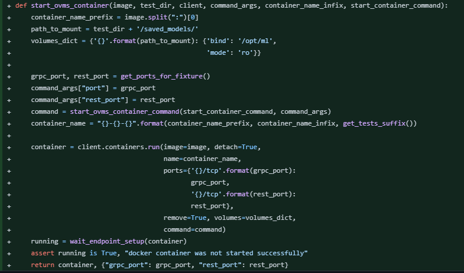
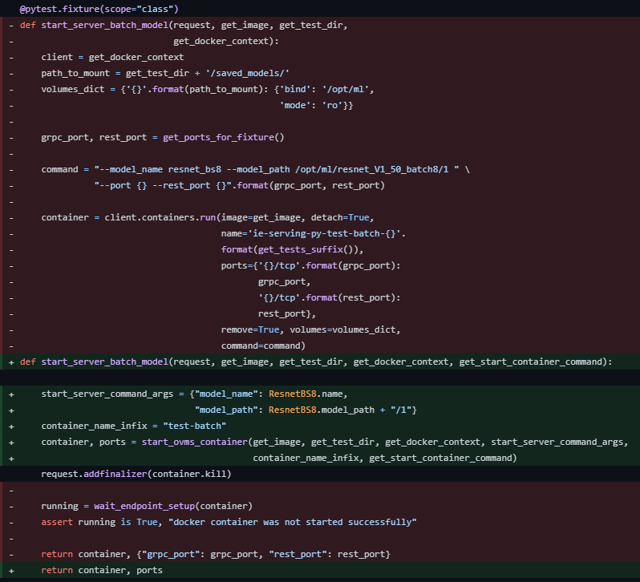
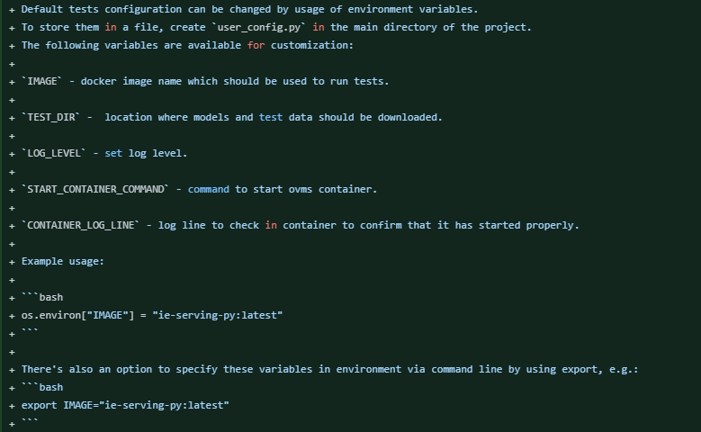
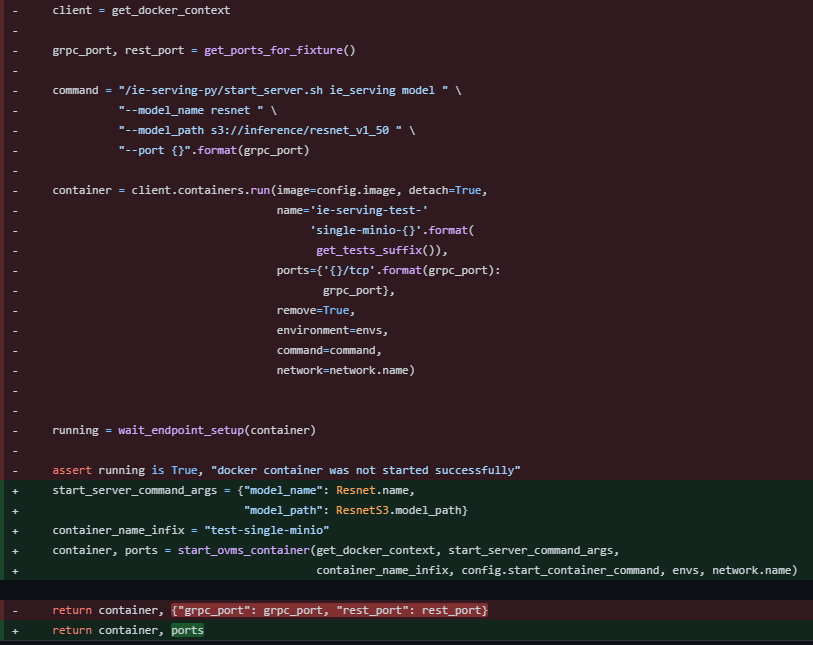
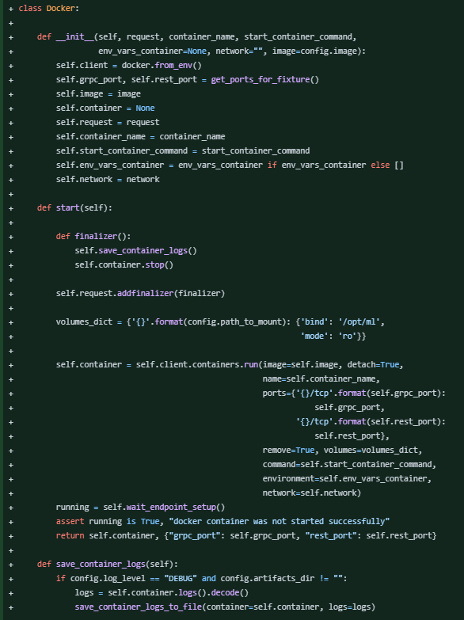
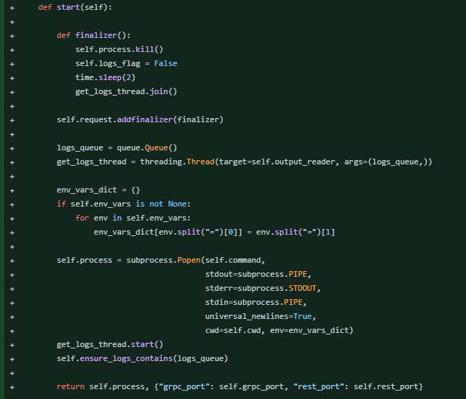
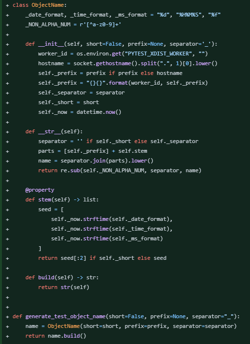

## Hello! 
**If you're here, you're possibly considering me for a position in your company.** 
**Thank you for your time and for giving me a chance!**

### Academic work

 
I highly encourage you to check out my thesis (written in Polish) - I had quite fun writing it and in the worst-case 
scenario you'll see some funky pictures created by a generative adversarial network. I've also attached pictures of my 
dog and a few bad puns, so I highly recommend it.

Brief summary: I used [StyleGAN2](https://github.com/NVlabs/stylegan2) (style-based GAN architecture) to create GAN 
generating impressionist paintings. 

### My professional work:

Unfortunately, most of the projects I worked on aren't open source but there's one I'd gladly share. 
OpenVINO™ Model Server (OVMS) is a high-performance system for serving machine learning models 
(see more: [OpenVINO Model Server](https://github.com/openvinotoolkit/model_server)).

Within this repository, I refactored plenty of legacy code and contributed to code reviews. 
Refactor of this repository happened while simultaneously tests were used - so it was important to not break their 
execution at any time.

Scope of changes: 
* PEP8 and OOP adjustments,
* fix of hard-coded values,
* improvement of code readability,
* implementation of a few features making team's life easier

_**Please note that image down each commit is just a short snippet of it.**_

**Added command wrapper for starting the server with machine learning models - building commands based on test parameters 
rather than using a hardcoded command.** 

<https://github.com/openvinotoolkit/model_server/commit/c9472e65ffa730968440f6a46476b3dee112b2d9>

***

**Refactor of the fixtures starting OVMS to use previously created command wrapper; removed recurring code, improved 
readability.** 

<https://github.com/openvinotoolkit/model_server/commit/ab16be1dc3f3f294c3aef12b4d86de1f2e1a95b1>

***

**Add option to control tests by the configuration file and environmental variables - simplifying the execution of tests 
both via IDE and command line.** 

<https://github.com/openvinotoolkit/model_server/commit/4fdfd0dd00f172622f5b4d46127c9eb4c784e4e6>

***

**Further refactor fixtures that start OVMS, MinIO and AWS Docker containers.**  

<https://github.com/openvinotoolkit/model_server/commit/7df385bef1c51d8747e8b6d1a2b2c56817ad4ed1>

***

**Created classes: Docker, MinioDocker, OvmsDocker to easily handle test objects. Prepared Server class for the future - 
to be able to test OVMS both as a Docker container and binary file within the process on a bare host.** 

<https://github.com/openvinotoolkit/model_server/commit/c8418bac8cf4f7add12a39f7b08ffb43871d8ca4>

***

**Enabled running tests for OVMS as a binary file within a shell and changed the MinIO endpoint (due to slight network 
adjustments). Added dynamic creation of JSON configuration files to handle more test cases.** 

<https://github.com/openvinotoolkit/model_server/commit/e62ecbf4289cc3e3d073bd281d62876f09d10355>

***

**Added generator creating unique container names to enable multiple parallel test runs within the same machine.** 

<https://github.com/openvinotoolkit/model_server/commit/c574b45f13691c3be4f4db2e9fdb8d5becc6d76c>

***

Thank you! If you have any questions, I will be happy to answer them.