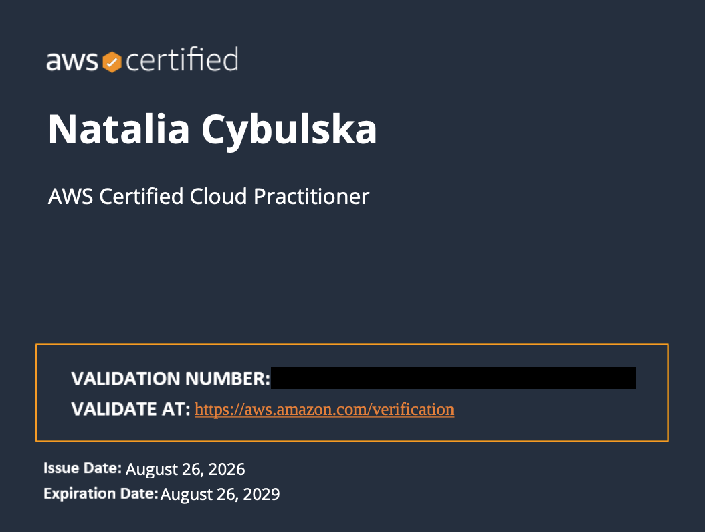
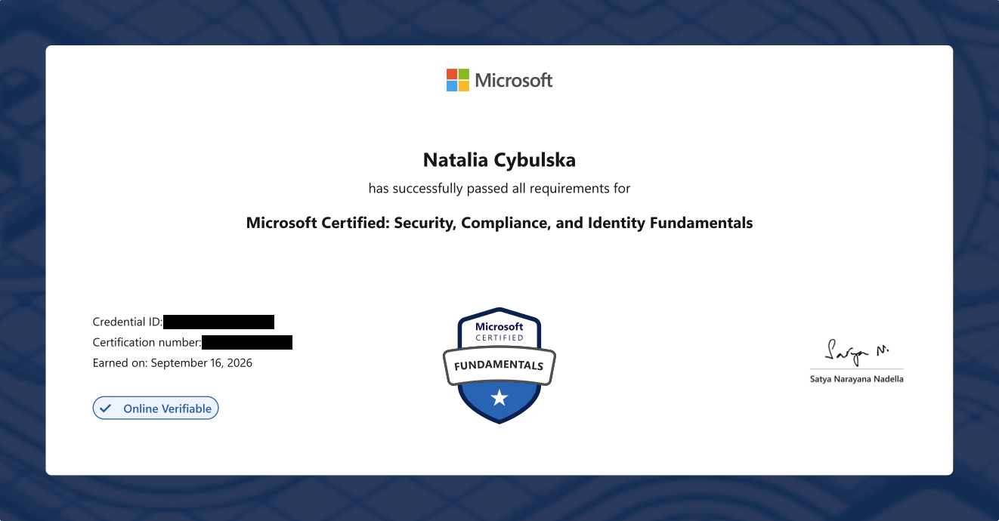
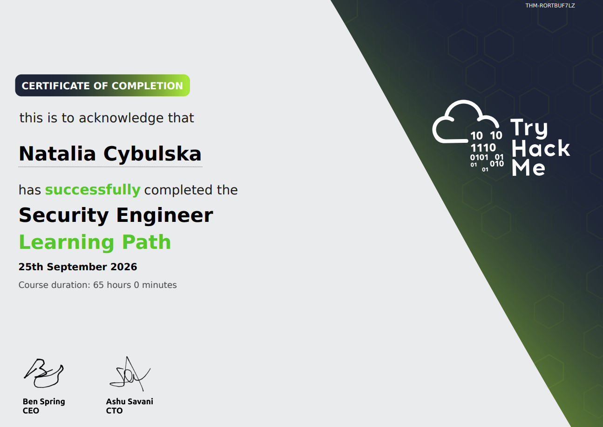
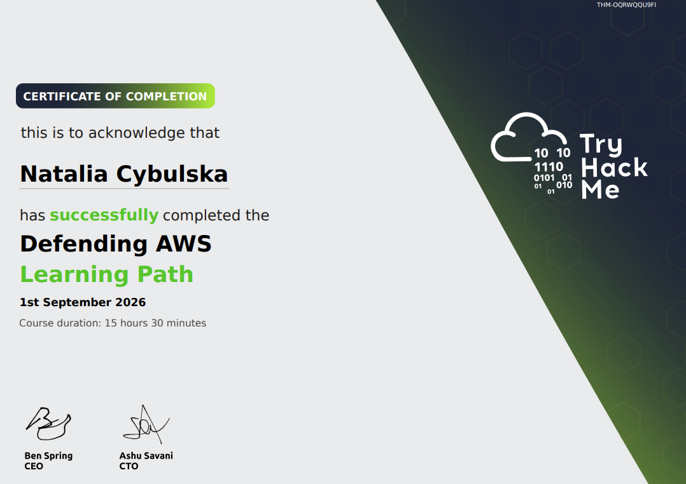
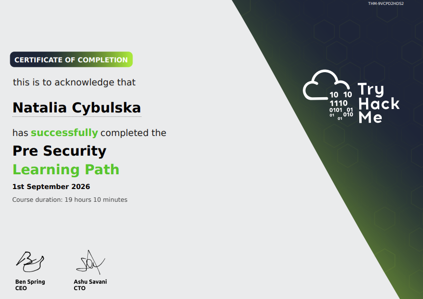

## Certifications

| Certification                                                        | Completed |
| -------------------------------------------------------------------- | --------- |
| Microsoft Certified: Security, Compliance, and Identity Fundamentals | Sep 2026  |
| AWS Certified Cloud Practitioner                                     | Aug 2026  |
| CompTIA Security+                                                    | Mar 2026  |
| Google Cybersecurity Professional Certificate                        | Feb 2026  |

## TryHackMe Learning Paths

**TryHackMe profile:** top 1% rank, 302 rooms completed, 274-day streak (yes, I'm aware of what that says about my evenings). Last updated: 25.09.2026 - but believe me, I'm still going. 

Each path is a structured sequence of dozens of guided rooms building toward a specific skill area. ~178 hours combined across the six paths below - that's paths only, actual time on TryHackMe is higher once you count stand-alone modules and rooms outside any path.

### Security Engineer

Learn the skills required to jumpstart a career in security engineering.

- Network security engineering
- System security engineering
- Software security engineering
- Risk management & responding to incidents

Completed Sep 2026 · 65h 00m · `THM-RORTBUF7LZ`

### Defending AWS

Learn how to secure the most common AWS services.

- Manage identities, access, and policies
- Harden the network layer
- Secure compute
- Ensure data integrity

Completed Sep 2026 · 15h 30m · `THM-OQRWQQU9FI`

### DevSecOps

Acquire specialization in DevSecOps or broaden your understanding of product security.

- Hands-on CI/CD Pipeline Security
- Introduction to Securing IaC
- Containerisation Security
- Applications of DevSecOps Frameworks

Completed Jul 2026 · 26h 45m · `THM-XBWXVZGFLS`

### Jr Penetration Tester

Learn the essential skills to break into penetration testing.

- Pentesting fundamentals, methodologies and tactics
- Full lifecycle from recon to reporting
- Hands-on web and network hacking
- Learn core tools used in cybersecurity

Completed Apr 2026 · 30h 40m · `THM-SHEAXOGIKH`

### Web Fundamentals

A pathway to web application security.

- Understand web fundamentals
- Major vulnerabilities explained
- Learn industry-used tools
- Web application assessments

Completed Apr 2026 · 20h 50m · `THM-DRGZIT27QO`

### Pre Security

Your first step into cyber. Learn how tech works, then think like an attacker and defender.

- Explore how computers really work
- Write your first lines of code
- Step into networking and web basics
- Think like a hacker or defender

Completed earlier, certificate generated Sep 2026 · 19h 10m · `THM-9VCPD2HDS2`

## Certificate & path images

*Verification codes withheld here on purpose - publicly posted certificate numbers are a documented vector for fraudulent credential misuse. Happy to send mine directly to recruiters.*

