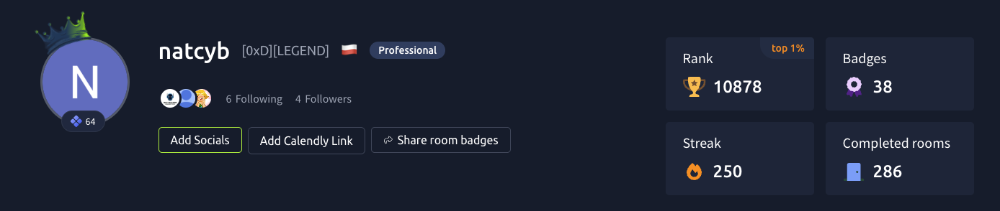
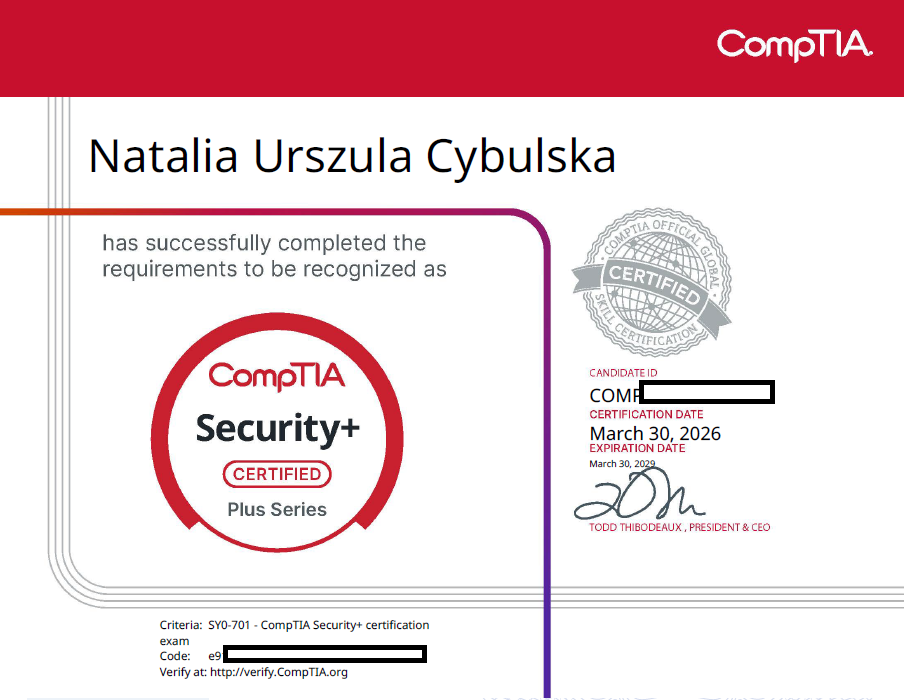
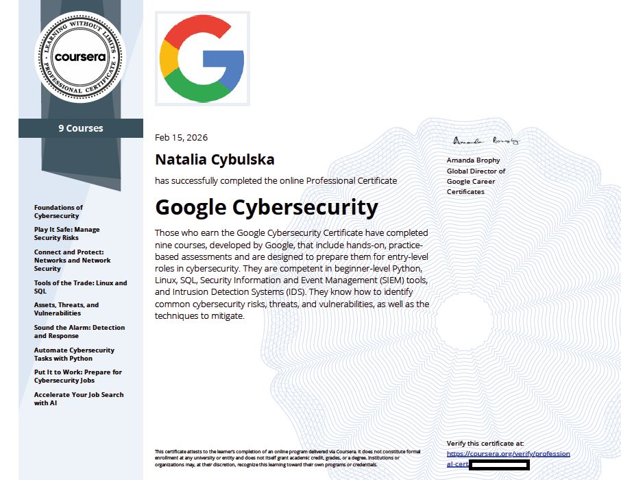
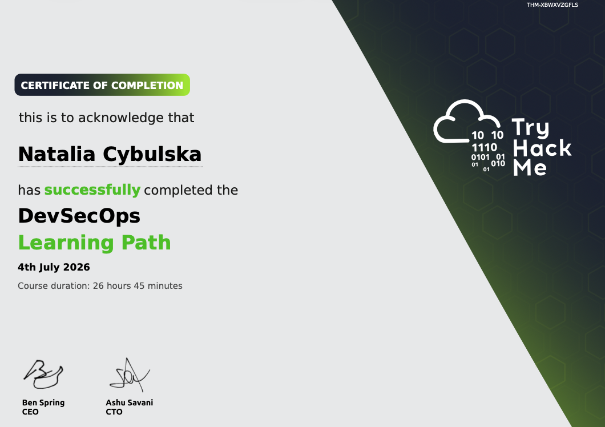
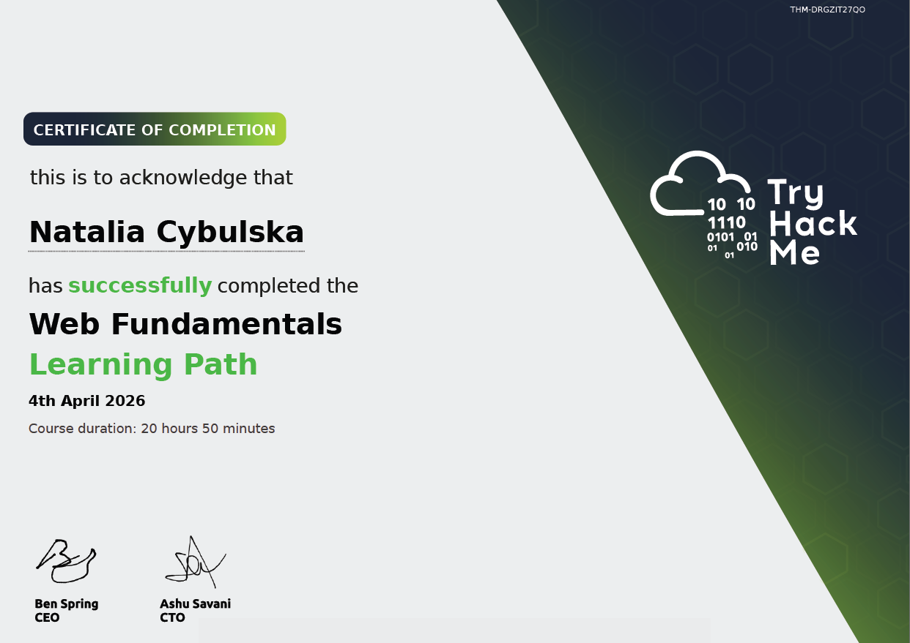

## Certifications

| Certification                                 | Issuer                | Completed |
| --------------------------------------------- | --------------------- | --------- |
| CompTIA Security+ (SY0-701)                   | CompTIA               | Mar 2026  |
| Google Cybersecurity Professional Certificate | Google (via Coursera) | Feb 2026  |

*Verification codes withheld here on purpose - publicly posted certificate numbers are a documented vector for fraudulent credential misuse. Happy to send mine directly to recruiters.*

*Next up: AWS Certified Cloud Practitioner.*

## TryHackMe Learning Paths

**TryHackMe profile:** top 1% rank, 276 rooms completed, 228-day streak (yes, I'm aware of what that says about my evenings). Last updated: 10-08-2026 - but believe me, I'm still going. 

Not proctored certifications. Each path is a structured sequence of dozens of guided rooms building toward a specific skill area. ~78 hours combined, listed separately so it's clear which is which.

| Path                  | Completed | Duration  | Credential ID    |
| --------------------- | --------- | --------- | ---------------- |
| DevSecOps             | Jul 2026  | 26h 45m   | `THM-XBWXVZGFLS` |
| Jr Penetration Tester | Apr 2026  | 30h 40m   | `THM-SHEAXOGIKH` |
| Web Fundamentals      | Apr 2026  | 20h 50m   | `THM-DRGZIT27QO` |

## Certificate & path images

