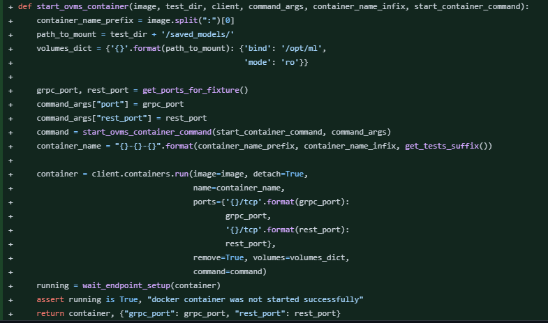
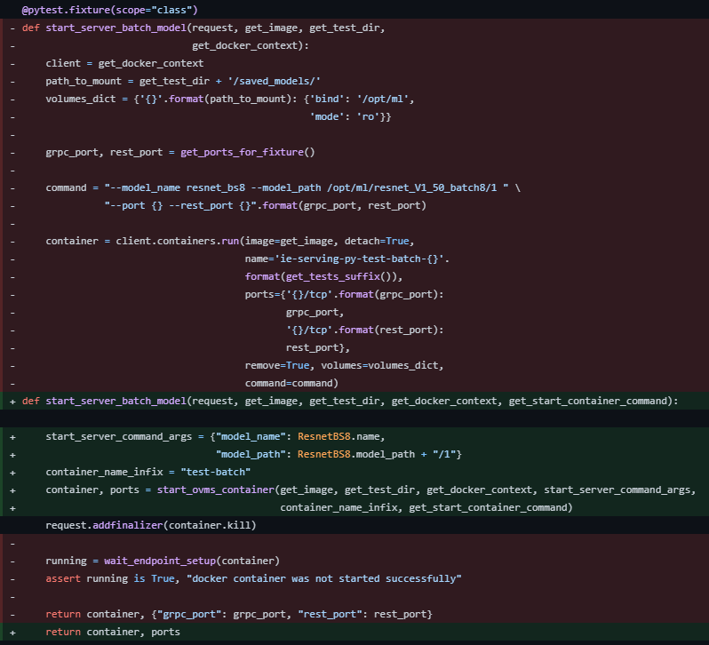
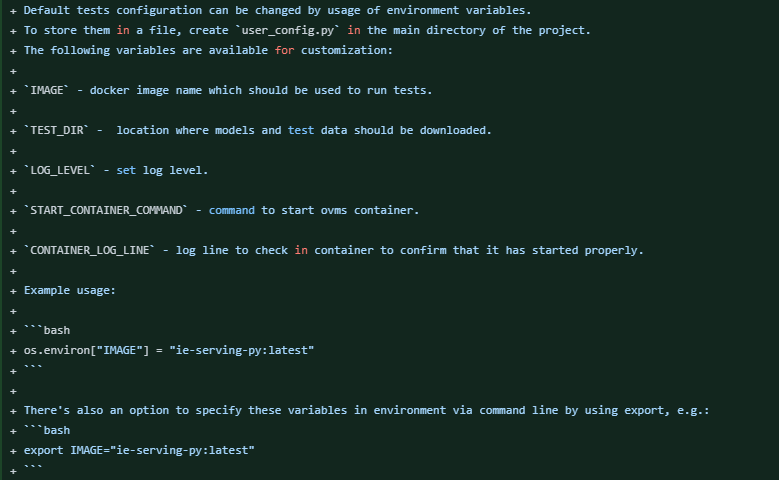
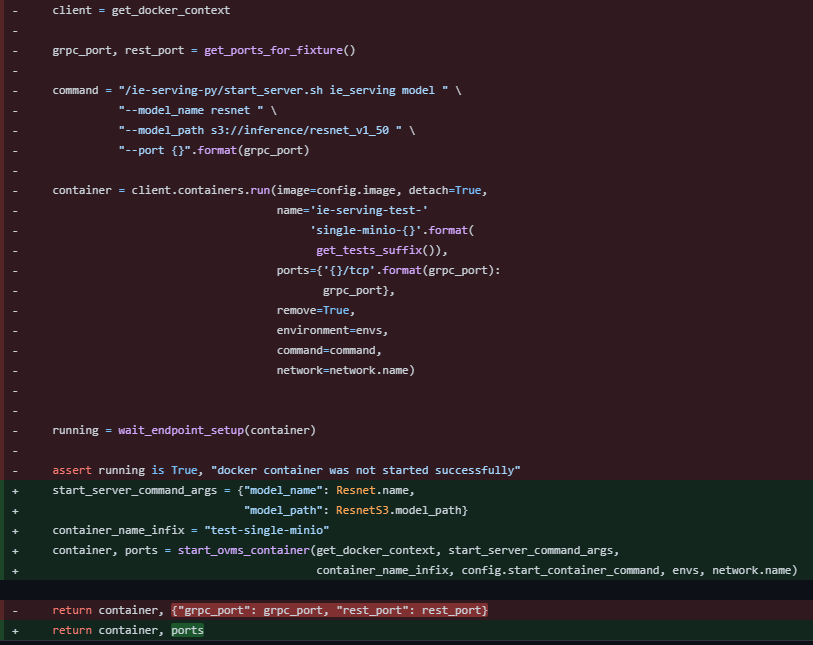
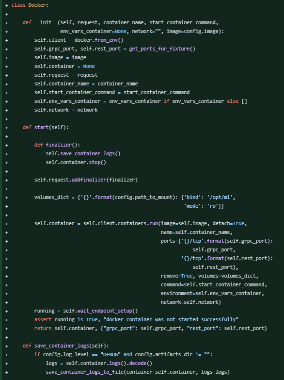
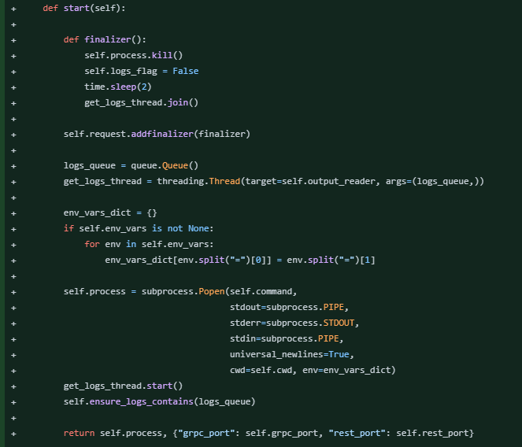
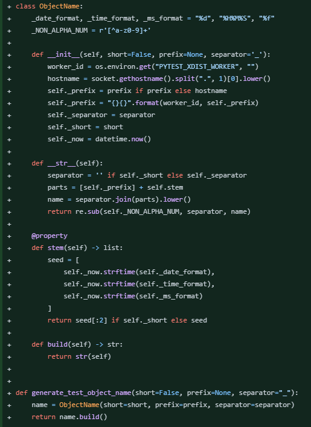

## Engineering Samples

Contributions merged into [OpenVINO™ Model Server](https://github.com/openvinotoolkit/model_server) (OVMS), Intel's open-source high-performance model-serving project - refactoring legacy test infrastructure without breaking the suite while I did it. I also contributed to code review on the same repo.

_Also predates LLM code assistants - so this is proof I can actually code, not just prompt._

**Scope:** PEP8/OOP cleanup, removing hard-coded values in favor of config-driven parameters, readability improvements, and a few quality-of-life features for the team.

_Each image below is a short snippet of the full commit — click the commit link above it for the full diff._

---

**Added command wrapper for starting the server with machine learning models - building commands based on test parameters rather than using a hardcoded command.** 

<https://github.com/openvinotoolkit/model_server/commit/c9472e65ffa730968440f6a46476b3dee112b2d9>

***

**Refactor of the fixtures starting OVMS to use previously created command wrapper; removed recurring code, improved 
readability.** 

<https://github.com/openvinotoolkit/model_server/commit/ab16be1dc3f3f294c3aef12b4d86de1f2e1a95b1>

***

**Add option to control tests by the configuration file and environmental variables - simplifying the execution of tests both via IDE and command line.** 

<https://github.com/openvinotoolkit/model_server/commit/4fdfd0dd00f172622f5b4d46127c9eb4c784e4e6>

***

**Further refactor fixtures that start OVMS, MinIO and AWS Docker containers.**  

<https://github.com/openvinotoolkit/model_server/commit/7df385bef1c51d8747e8b6d1a2b2c56817ad4ed1>

***

**Created classes: Docker, MinioDocker, OvmsDocker to easily handle test objects. Prepared Server class for the future - 
to be able to test OVMS both as a Docker container and binary file within the process on a bare host.** 

<https://github.com/openvinotoolkit/model_server/commit/c8418bac8cf4f7add12a39f7b08ffb43871d8ca4>

***

**Enabled running tests for OVMS as a binary file within a shell and changed the MinIO endpoint (due to slight network adjustments). Added dynamic creation of JSON configuration files to handle more test cases.** 

<https://github.com/openvinotoolkit/model_server/commit/e62ecbf4289cc3e3d073bd281d62876f09d10355>

***

**Added generator creating unique container names to enable multiple parallel test runs within the same machine.** 

<https://github.com/openvinotoolkit/model_server/commit/c574b45f13691c3be4f4db2e9fdb8d5becc6d76c>

***

Even then, I found myself gravitating toward good design and security practices: read-only mounts, pytest finalizers that guarantee teardown even when a test fails, config instead of hardcoded values. Old habits, new job title.
