# Mother's Secret


This writeup documents the full thought process behind solving this room - including dead ends and happy accidents - rather than presenting a clean, linear solution


Task instructions:

```
1. Explore the available endpoints of the Mother Server and try to find any clues that can reveal mother's secret.
2. Search for a file that contains essential information about the ship's activities.
3. Exploit the vulnerable code to download the secrets from the server. Can you spot the vulnerable code?
4. Capture all the hidden flags you encounter during your exploration. Only Mother holds this secret.
   
Below are some sequences and operations to get you started. Use the following to unlock information and navigate Mother:  

- Emergency command override is 100375. Use it when accessing _Alien Loaders_. 
- Download the task files to learn about Mother's routes.
- Hitting the _routes_ in the _right_ order makes Mother confused, it might think you are a Science Officer!

**Can you guess what is /api/nostromo/mother/secret.txt?**
```


## Static analysis

Two files with source code were provided as a starting point:


`yaml.js`
```javascript
import express from "express";
import yaml from "js-yaml";
import fs from "fs";
import { attachWebSocket } from "../websocket.js";

const Router = express.Router();

const isYaml = (filename) => filename.split(".").pop() === "yaml";

Router.post("/", (req, res) => {
  let file_path = req.body.file_path;
  const filePath = `./public/${file_path}`;

  if (!isYaml(filePath)) {
    res.status(500).json({
      status: "error",
      message: "Not a YAML file path.",
    });
    return;
  }

  fs.readFile(filePath, "utf8", (err, data) => {
    if (err) {
      res.status(500).json({
        status: "error",
        message: "Failed to read the file.",
      });
      return;
    }

    res.status(200).send(yaml.load(data));

    attachWebSocket().of("/yaml").emit("yaml", "YAML data has been processed.");
  });
});

export default Router;
```


---


`Nostromo.js`

```javascript
import express from "express";
import fs from "fs";
// import { attachWebSocket } from "../../mothers_secret_challenge/websocket.js";
import { attachWebSocket } from "../websocket.js";
import { isYamlAuthenticate } from "./yaml.js";
let isNostromoAuthenticate = false;

const Router = express.Router();

Router.post("/nostromo", (req, res) => {
  let file_path = req.body.file_path;
  const filePath = `./public/${file_path}`;

  fs.readFile(filePath, "utf8", (err, data) => {
    if (err) {
      res.status(500).json({
        status: "error",
        message: "Science Officer Eyes Only",
      });
      return;
    }

    isNostromoAuthenticate = true
    res.status(200).send(data);

    attachWebSocket()
      .of("/nostromo")
      .emit("nostromo", "Nostromo data has been processed.");
  });
});

Router.post("/nostromo/mother", (req, res) => {
 
  let file_path = req.body.file_path;
  const filePath = `./mother/${file_path}`;

  if(!isNostromoAuthenticate || !isYamlAuthenticate){
    res.status(500).json({
      status: "Authentication failed",
      message: "Kindly visit nostromo & yaml route first.",
    });
    return 
  }

  fs.readFile(filePath, "utf8", (err, data) => {
    if (err) {
      res.status(500).json({
        status: "error",
        message: "Science Officer Eyes Only",
      });
      return;
    }

    res.status(200).send(data);

    // attachWebSocket()
    //   .of("/nostromo")
    //   .emit("nostromo", "Nostromo data has been processed.");
  });
});

export default Router;
```


---

## SAST tools

I ran both files through static analysis tools to see how well automated scanners would catch the issues.

### ESLint


```
# npx eslint yaml.js Nostromo.js --format stylish

/root/sast/Nostromo.js
   1:21  error  Can't resolve 'express' in '/root/sast'                                n/no-missing-import
   4:33  error  Can't resolve '../websocket.js' in '/root/sast'                        n/no-missing-import
  11:7   error  'file_path' is never reassigned. Use 'const' instead                   prefer-const
  14:3   error  Found readFile from package "fs" with non literal argument at index 0  security/detect-non-literal-fs-filename
  34:7   error  'file_path' is never reassigned. Use 'const' instead                   prefer-const
  45:3   error  Found readFile from package "fs" with non literal argument at index 0  security/detect-non-literal-fs-filename

/root/sast/yaml.js
   1:21  error  Can't resolve 'express' in '/root/sast'                                n/no-missing-import
   2:18  error  Can't resolve 'js-yaml' in '/root/sast'                                n/no-missing-import
   4:33  error  Can't resolve '../websocket.js' in '/root/sast'                        n/no-missing-import
  11:7   error  'file_path' is never reassigned. Use 'const' instead                   prefer-const
  22:3   error  Found readFile from package "fs" with non literal argument at index 0  security/detect-non-literal-fs-filename

\u2716 11 problems (11 errors, 0 warnings)
  3 errors and 0 warnings potentially fixable with the `--fix` option.
```

The `security/detect-non-literal-fs-filename` rule did flag the `fs.readFile` calls using dynamic arguments but didn't explicitly say why this is dangerous.

### semgrep 


```
# semgrep --config p/javascript yaml.js Nostromo.js

Scanning 2 files (only git-tracked) with 74 Code rules:
            
  CODE RULES
  Scanning 2 files with 68 js rules.
                    
  SUPPLY CHAIN RULES
                                                                       
  \U0001f48e Sign in with `semgrep login` and run               
     `semgrep ci` to find dependency vulnerabilities and
     advanced cross-file findings.                                     
                                                                       
          
                
Scan Summary 

(need more rules? `semgrep login` for additional free Semgrep Registry rules)

Ran 68 rules on 2 files: 0 findings.
\U0001f48e Missed out on 242 pro rules since you aren't logged in!
\u26a1 Supercharge Semgrep OSS when you create a free account at https://sg.run/rules.

```

This result wasn't successful at all but I've taken notice of ` Missed out on 242 pro rules since you aren't logged in`. What hurts to try? I logged in with a free account, unlocking the 242 pro rules, and reran the scan:

```
3 Code Findings

                              
    Nostromo.js
    \u276f\u2771 javascript.express.express-fs-filename.express-fs-filename
          The application builds a file path from potentially         
          untrusted data, which can lead to a path traversal          
          vulnerability. An attacker can manipulate the file path     
          which the application uses to access files. If the          
          application does not validate user input and sanitize file  
          paths, sensitive files such as configuration or user data   
          can be accessed, potentially creating or overwriting files. 
          To prevent this vulnerability, validate and sanitize any    
          input that is used to create references to file paths. Also,
          enforce strict file access controls. For example, choose    
          privileges allowing public-facing applications to access    
          only the required files.                                    
          Details: https://sg.run/0B9W                                
                                                                      
           14\u2506 fs.readFile(filePath, "utf8", (err, data) => {
            \u22ee\u2506----------------------------------------
           45\u2506 fs.readFile(filePath, "utf8", (err, data) => {
                          
    yaml.js
    \u276f\u2771 javascript.express.express-fs-filename.express-fs-filename
          The application builds a file path from potentially         
          untrusted data, which can lead to a path traversal          
          vulnerability. An attacker can manipulate the file path     
          which the application uses to access files. If the          
          application does not validate user input and sanitize file  
          paths, sensitive files such as configuration or user data   
          can be accessed, potentially creating or overwriting files. 
          To prevent this vulnerability, validate and sanitize any    
          input that is used to create references to file paths. Also,
          enforce strict file access controls. For example, choose    
          privileges allowing public-facing applications to access    
          only the required files.                                    
          Details: https://sg.run/0B9W                                
                                                                      
           22\u2506 fs.readFile(filePath, "utf8", (err, data) => {

```

Bingo! The setup was fairly easy and it returned the result I was hoping for. Today I gained an additional tool that I could use for my daily work arsenal. 

Semgrep found 3 issues with path traversal: 

yaml.js
```
Router.post("/", (req, res) => {
  let file_path = req.body.file_path;
  const filePath = `./public/${file_path}`;
```


Nostromo.js
```
Router.post("/nostromo", (req, res) => {
  let file_path = req.body.file_path;
  const filePath = `./public/${file_path}`;
```

Zero friction to get started, meaningful results after a free signup, and it integrates cleanly into CI pipelines. If you're doing any amount of code review or CTF prep, Semgrep earns its place in the toolbox.

## Exploring the target

The root of the website consisted of a simple menu - I've inspected the code and didn't find any further clues. 

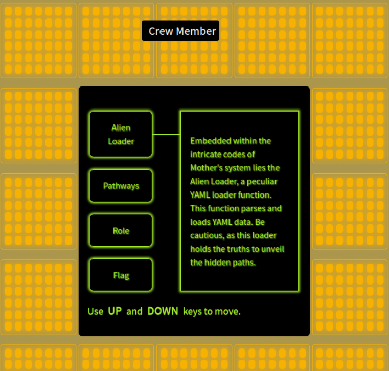


Attempting to access endpoints directly returned a consistent error.

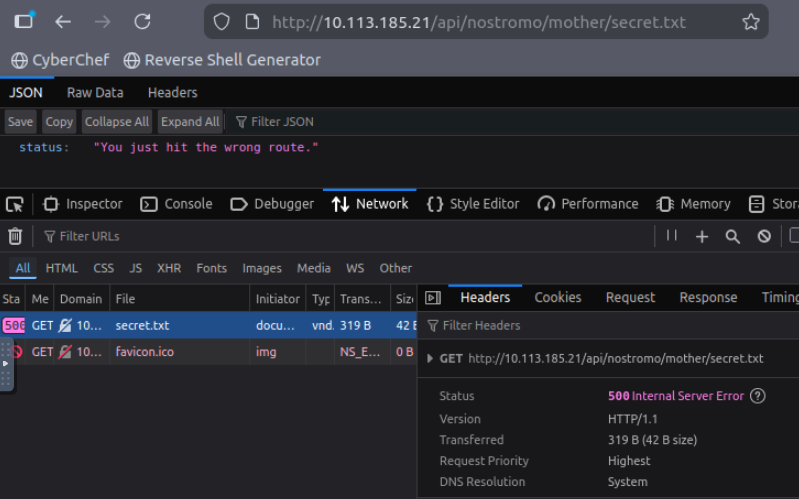


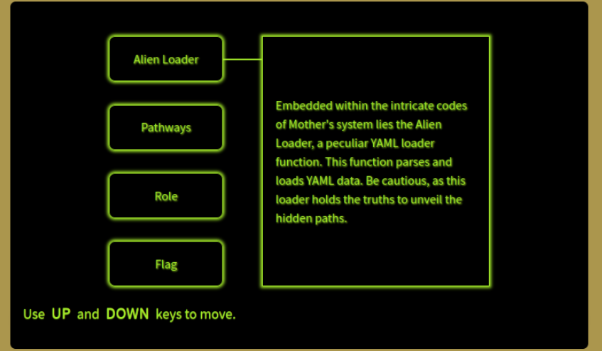

The task hint pointed toward the YAML loader as the entry point.

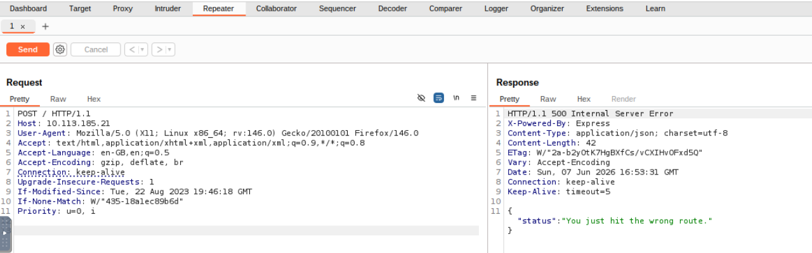

### Flag 1: the order file

This is where I hit my first wall. I tried various POST requests to `/api/yaml` and `/public` endpoints with different payloads, but nothing landed. The emergency command override `100375` was the key - and a GET request to `http://10.113.185.21/100375.yaml` accidentally returned the file contents directly. This came back to bite me later in this task.

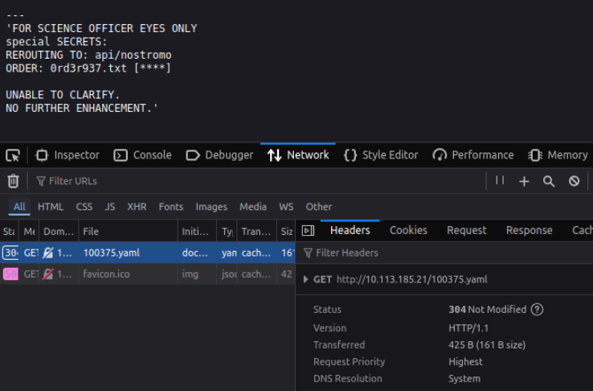

I initially went down a rabbit hole trying to spoof the `Referer` header to match the YAML file's URL, hoping the server would treat it as coming from a trusted internal route. That didn't work out - the server wasn't checking `Referer` at all. 
The YAML file pointed to `0rd3r937.txt`. Navigating directly to `http://10.113.185.21/0rd3r937.txt` worked and revealed the flag.

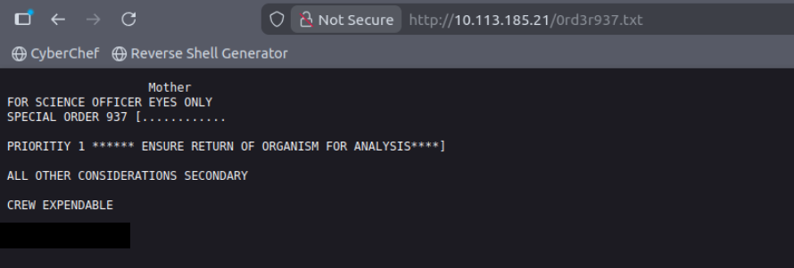


### Flag 2: Mother's secret

The next question was: "What is the name of the Science Officer with permissions?" and the hint for it:
`When the role changes a new name is displayed`

Well, there was something about the role:
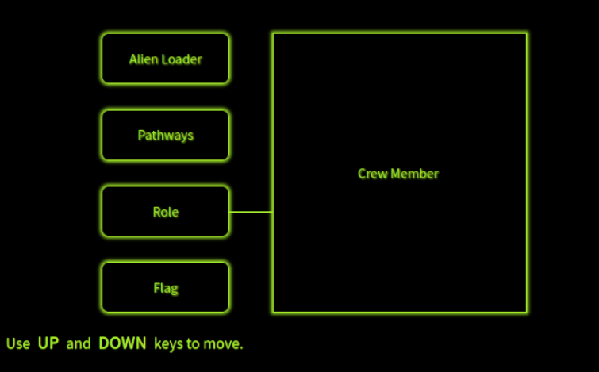


I've decided to go back to the code, the corresponding part:

```javascript
Router.post("/nostromo", (req, res) => {
  let file_path = req.body.file_path;
  const filePath = `./public/${file_path}`;

  fs.readFile(filePath, "utf8", (err, data) => {
    if (err) {
      res.status(500).json({
        status: "error",
        message: "Science Officer Eyes Only",
      });
      return;
    }

    isNostromoAuthenticate = true
    res.status(200).send(data);

    attachWebSocket()
      .of("/nostromo")
      .emit("nostromo", "Nostromo data has been processed.");
  });
});
```

After some time I deducted- this was the bite I mentioned earlier: because I'd read the file directly via GET instead of going through the intended POST flow, I never triggered `isYamlAuthenticate`, so the app still didn't recognize me as authenticated. I needed to make a POST request to a `nostromo` endpoint with correct file_path. I've used Burp Repeater to send this request and authenticate:

The actual intended path was to POST the YAML filename to the `/api/yaml` endpoint with `{"file_path": "100375.yaml"}`, which would set `isYamlAuthenticate = true` server-side. I then repeated similar solution with POST request as below:

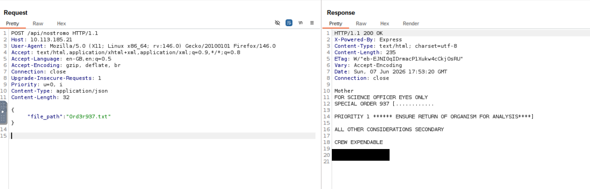


The UI updated and the Science Officer's name appeared.

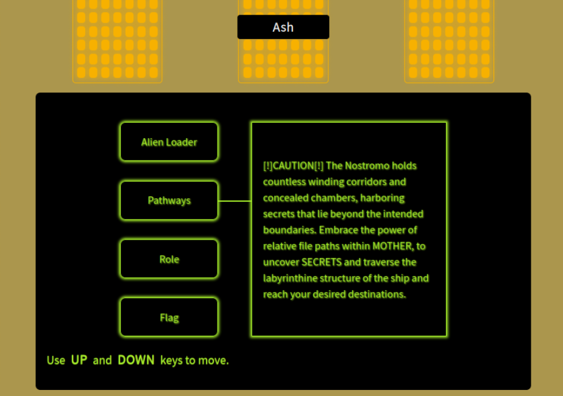

Continuing the method of sending POST requests with file_path as a payload and a hint that the secret was hidden in this path `/api/nostromo/mother/secret.txt` - I've got the location of the final flag. 


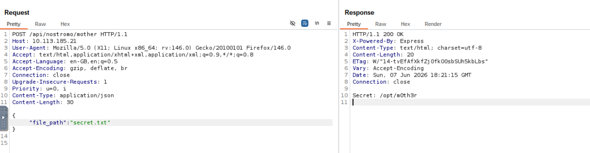

The secret file lives at `/opt/m0th3r`, but the server reads from `./mother/${file_path}`. To escape the `./mother/` base directory and reach `/opt/m0th3r` I used previously found path traversal vulnerability. 


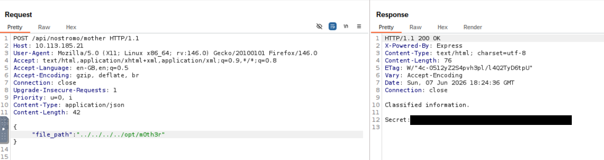
